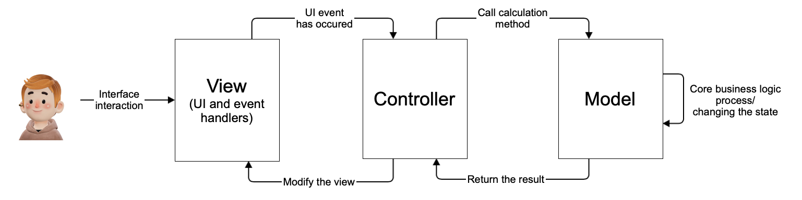

# **SmartCalc v2.0**


## **Описание проекта**

Проект предоставляет возможность проведения множества математических операций. А также имеет 3 дополнительных модуля (отрисовка графиков, кредитный калькулятор, депозитный калькулятор). Главной отличительной чертой от [SmartCalc v1.0](https://github.com/Hasuk1/School-21-SmartCalc_v1.0) является использование MVC-паттерна.

Паттерн `MVC` (Model-View-Controller, Модель-Представление-Контроллер) представляет из себя схему разделения модулей приложения на три отдельных макрокомпонента: модель, содержащую в себе бизнес-логику, представление - форму пользовательского интерфейса для осуществления взаимодействия с программой и контроллер, осуществляющий модификацию модели по действию пользователя.



## **Калькулятор и построение графиков** 

Калькулятор способен производить расчет выражений в инфиксной записи. 
 Также он способен производить расчет выражений с переменной `x` и подстановкой его значений в виде числа.
 Ввод выражения осуществляется с помощью интерфейса, а затем пользователь может нажать на знак "=" для получения результата.

Во второй версии программы переработан функционал приложения. Теперь есть ввод с клавиатуры, обработка чисел в экспоненциальной записи, корректное отображаение строки вывода выражения. 


- Интерфейс и функциональность обычного калькулятора и графиков были вдохновлены принципами и дизайном калькулятора Google. Это обеспечивает знакомую и удобную среду для пользователей.

## **Кредитный калькулятор**

Кредитный калькулятор предоставляет возможность оценить параметры и затраты по кредиту перед его взятием.

Теперь можно увидеть весь список платежей для дифференцированных платежей, внесены правки в формулу расчета, для более точных результатов, а также отлажены ошибки в работе интерфейса с некорректными данными.


- Для разработки кредитного калькулятора использовались принципы и алгоритмы с сайта [calcus.ru](https://calcus.ru/kreditnyj-kalkulyator), гарантируя точные и надежные расчеты по кредитам.

## **Депозитный калькулятор** 

Депозитный калькулятор предоставляет возможность оценить доходность и налогообложение депозита перед его размещением. Он расчитывает начисленные проценты в зависимости от суммы депозита, срока размещения, процентной ставки, налоговой ставки, периодичности выплат и капитализации процентов.

Была исправленна формула, для корректного расчета налога. Интерфейс учитывает размеры отображаемой информации и подстраивается под неё.


- Для депозитного калькулятора использовались данные и методология расчетов с сайта [banki.ru](https://www.banki.ru/services/calculators/deposits/), обеспечивая точность и актуальность данных.

## **Supported platforms**

- [x] Linux
- [x] MacOS
- [ ] Windows

## **Stack**

<div>
    &nbsp;
    &nbsp;
    &nbsp;
    
</div>

## **Installation** 

```shell
git clone git@github.com:Hasuk1/School-21-SmartCalc_v2.0.git
cd School-21-SmartCalc_v2.0/src
make install
```

###### Приложение было создано в рамках программы обучения в школе-21.
